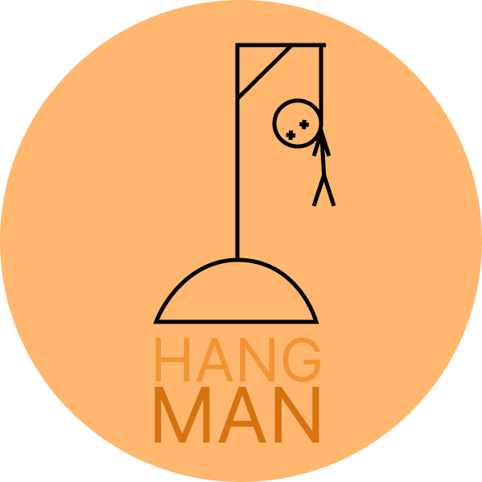

# Hangman
Has this ever happened to you? You are talking with your friends online and get bored, if only you could play the fun games from your childhood again. But Frank had to move away because of his girlfriend and Lisa is studying abroad. If only we could get together... Oh but wait! Two novice dev-students created a digital hangman where we all could connect, what a game-changer!  
Jennie and Josefine introduce to you... a multi-player game of hangman!

## Stack

  
  
  

## Git-workflow 

**Production/main branch** - only for safe and tested merges  
**Dev branch** - the main branch we merge and clone  
**Feature branch** - the branches we work on   

The naming of feature-branches should be explanatory like "Feature--LogIn" or "Bugfix--content-overflow". Idéally no branches with bugs should be merged into the dev-branch.

## Installation

clone down the repository 
npm install in the terminal
node index.js

## Assignment
Create something that solves a problem 
